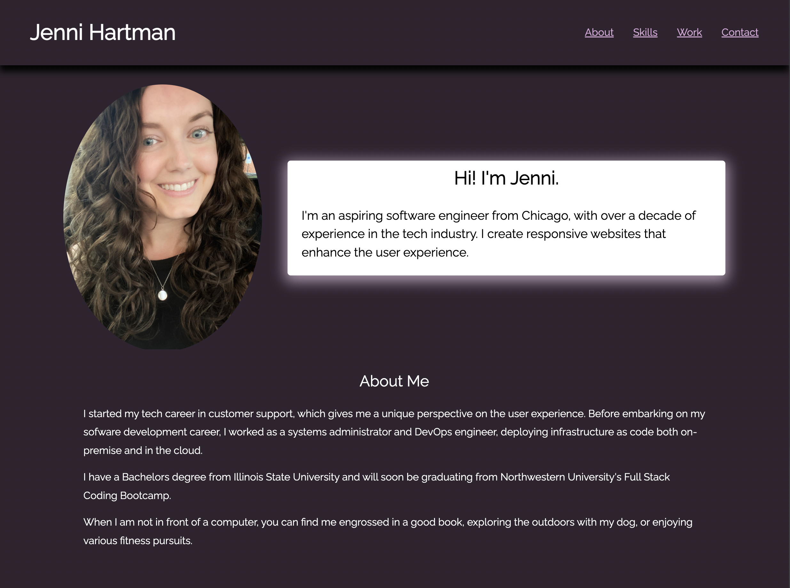
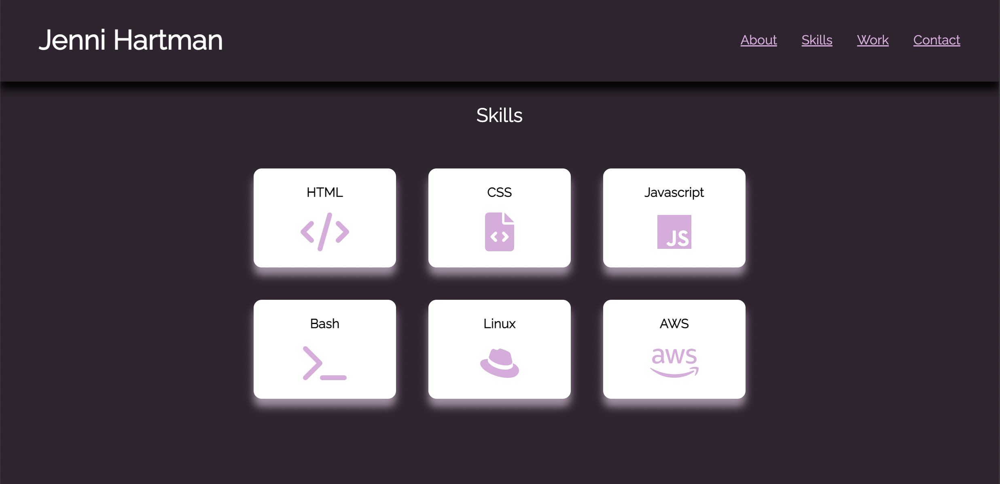
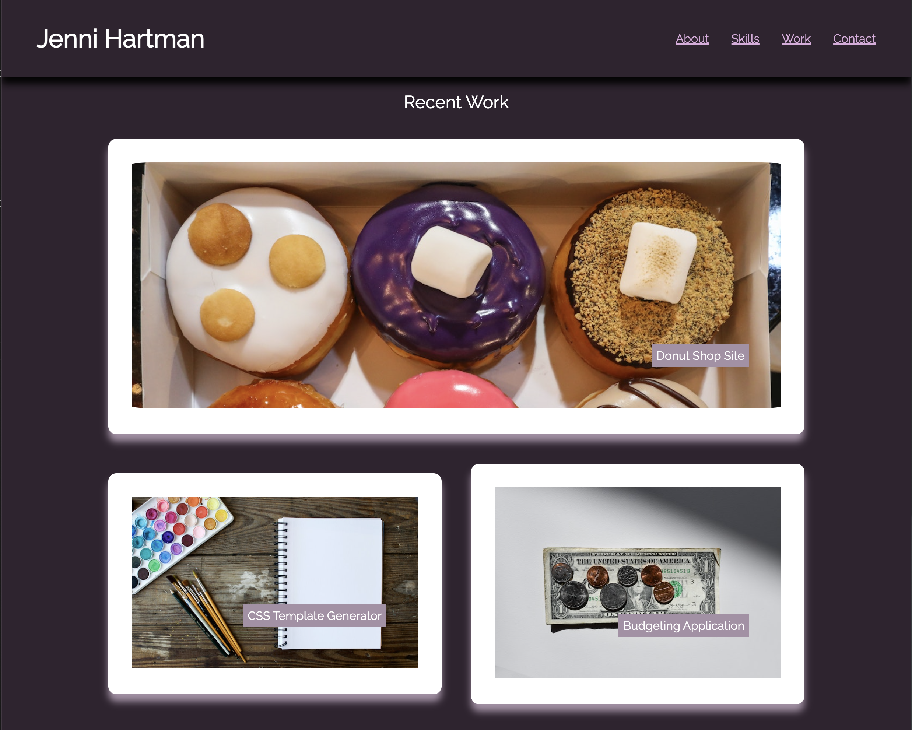

# Personal Portfolio

My [portfolio page](https://jenniwritescode.github.io/portfolio/) uses HTML and CSS to create a minimal, responsive website to provide information about my background, skills, work, and contact information.

The website is published using GitHub pages.

### Features:

- Sticky navigation bar with shadow. Links scroll smoothly to each section on the page when clicked.
- Intro section (flex box)
- About Me section
- Skills section (flex box)
- Work section (flex box with children)
- Contact Me section

Extras: I utilized Google Fonts and Font Awesome icons.

### Screenshots:

As seen when scrolling down page:

